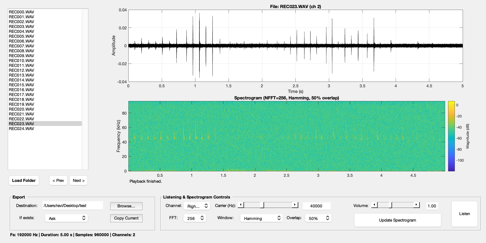

# **Bat Reviewer – Bat Call Review and Listening GUI**

BatReviewer() is a MATLAB GUI for browsing, listening to, and curating ultrasonic bat call recordings.

It is designed to streamline the workflow of reviewing .wav files recorded in the field by combining waveform and spectrogram visualisation, heterodyne listening with adjustable carrier frequency, and easy file export tools.


<p align="center">
  <a href="img/BatReviewer.png">
    
  </a>
  <br>
  <em>Bat Reviewer V1.0</em>
</p>

## **Features**

- **Folder Browser**
  - Load a folder of .wav files.
  - Navigate through recordings using *Prev* / *Next* buttons or a listbox.

  
  
- **Waveform Display**
  
  - Time-domain plot of the selected channel.
  - Metadata panel shows sampling rate, duration, number of channels, and sample count.
  
  
  
- **Spectrogram Viewer**

  - Customisable parameters (FFT size, window type, overlap).
- Colour-scaled dB spectrogram with labelled frequency axis in kHz.
  
  

- **Heterodyne Listening**

  - Adjustable **carrier frequency** (15–85 kHz).
- **Channel selection** (left/right/mono or multi-channel).
  - **Volume control** (0–300%).
  - Audio is automatically resampled to 44.1 kHz for playback.
  
  

- **File Export Panel**

  - Select export destination.
  - Copy current file with overwrite/auto-rename/ask options.
  
  
  
- **Status Updates**

  - Clear status messages for load, playback, export, and errors.

## **Usage**

### **1. Start the GUI**

Run in MATLAB:

```MATLAB
BatReviewer();
```

### **2. Load Recordings**

- Click **Load Folder** and select a directory containing .wav files.
- Files will be listed in the left panel.


### **3. Navigate and Inspect**

- Use < Prev and Next > buttons or click in the file list.
- The waveform and spectrogram update automatically.


### **4. Listen in Heterodyne Mode**

- Select **channel** (Left, Right, Mono, or numbered).
- Adjust **carrier frequency** (Hz) via slider or manual input.
- Adjust **volume** (0.0–3.0 multiplier).
- Press **Listen** to start heterodyne playback; press again to stop.


### **5. Adjust Spectrogram**

- Choose FFT size (256–2048), window type (Hann, Hamming, Blackman), and overlap (50%/75%).
- Press **Update Spectrogram** to refresh.


### **6. Export Recordings**

- Set **Destination** folder.
- Choose policy if file exists: *Ask*, *Overwrite*, *Auto-rename*.
- Press **Copy Current** to copy the selected file.

------


## **Heterodyne Processing**

The GUI relies on the helper function:

```MATLAB
[hetAudio, fs] = heterodyneAudio(audioFilename, carrierFreq, channel)
```


### **Functionality:**

1. Reads a .wav file and extracts the specified channel.
2. Applies a bandpass filter (1–90 kHz) to clean the signal.
3. Mixes the signal with a cosine carrier at the chosen frequency (carrierFreq).
4. Applies an automatic gain correction to preserve RMS energy.
5. Applies an optional **low-pass FIR filter** (≤30 kHz cutoff) to remove high-frequency artefacts.
6. Returns heterodyned audio and the original file’s sampling rate.


### **Inputs:**

- audioFilename – path to .wav file.
- carrierFreq – heterodyne carrier frequency (Hz).
- channel – channel number (default = 1).


### **Outputs:**

- hetAudio – time-domain heterodyned signal.
- fs – original sampling frequency.


## **Requirements**

- MATLAB R2019b or newer (GUI + audio toolbox needed).
- Signal Processing Toolbox (for designfilt / resample).
- .wav files with ultrasonic recordings.


## **Example Workflow**

1. Record bat calls with your detector at 192 kHz sampling or any rate supported by your device.
2. Open BatReviewer() in MATLAB.
3. Load the folder of recordings.
4. Inspect calls using waveform + spectrogram.
5. Listen to different heterodyne carriers (e.g., 40 kHz, 50 kHz).
6. Copy interesting files to a curated folder for further analysis.


## **LICENSE**

This work is licensed under a

[Creative Commons Attribution-NonCommercial 4.0 International License](https://creativecommons.org/licenses/by-nc/4.0/).


