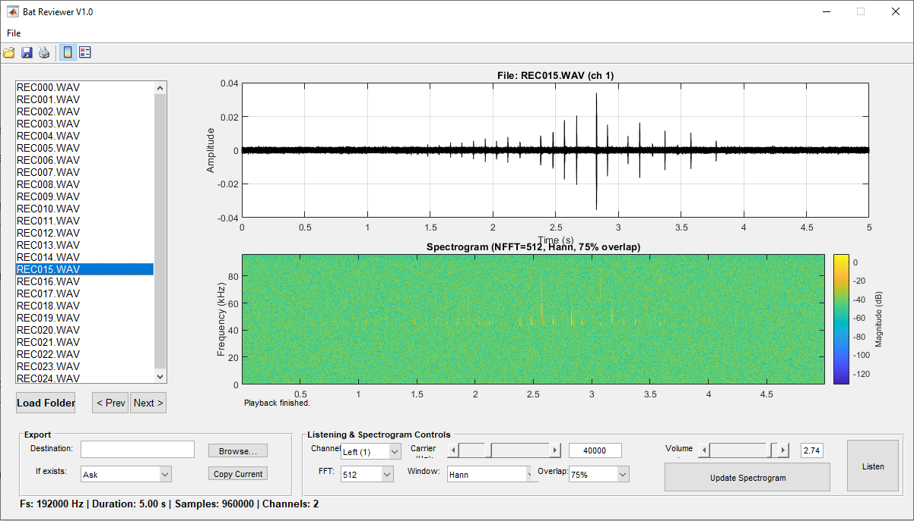
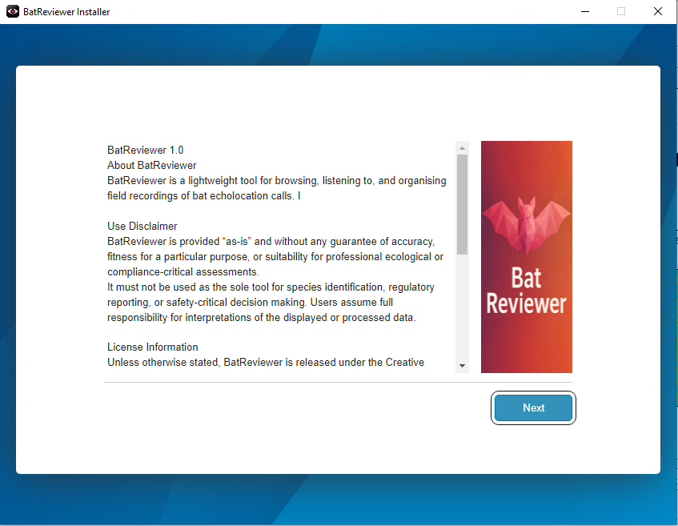
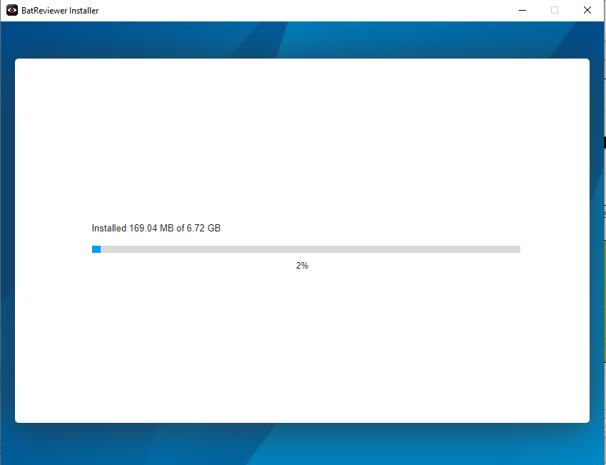

## About Bat Reviewer

Bat Reviewer is a tool for browsing, listening to, and organising field recordings of bat echolocation calls. It enables rapid visualisation of waveforms and spectrograms, basic signal inspection, file copying, and heterodyne audio preview for quick in-field analyses.

##  Installation

Bat Reviewer requires MATLAB Runtime 2023b, a free tool available that requires no license or installation of MATLAB on the user's computer. 

The installation packages provide a web installer that downloads and installs the MATLAB Runtime (MCR) along with the Bat Reviewer package. Ensure a reliable internet connection for the MCR download.

The standalone software is available for macOS (Apple Silicon) and Windows X64. Download the release suitable for your OS and install it like any package. 

The first time it is run, it may require additional setup in the backend; therefore, it may seem sluggish. Subsequent launches run normally.

## macOS Installation

## Windows Installer

## Use Disclaimer
BatReviewer is provided “as-is” and without any guarantee of accuracy, fitness for a particular purpose, or suitability for professional ecological or compliance-critical assessments.
It should not be used as the sole tool for species identification, regulatory reporting, or safety-critical decision-making. Users assume full responsibility for interpretations of the displayed or processed data.

## License Information
Unless otherwise stated, BatReviewer is released under the Creative Commons Attribution 4.0 International License (CC BY 4.0).
You are free to share, adapt, and build upon the software and generated outputs, provided that appropriate credit is given to the original author.

## Data and Privacy Notice
BatReviewer processes audio files locally on your device and does not transmit or store data externally. Users are responsible for ensuring that any field recordings processed with this software comply with local regulations, permit requirements, and institutional data-handling policies.

## Liability
The author is not liable for any direct or indirect damages arising from the use of this software, including but not limited to data loss, misinterpretation of results, or erroneous ecological conclusions.